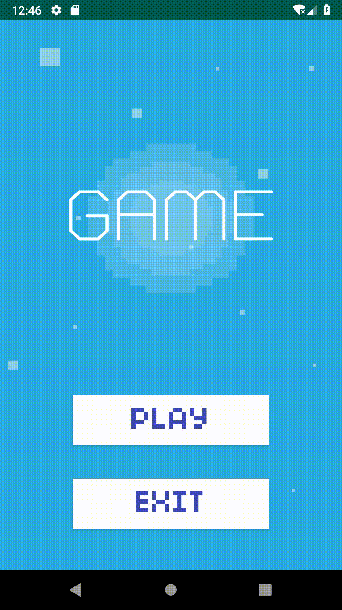
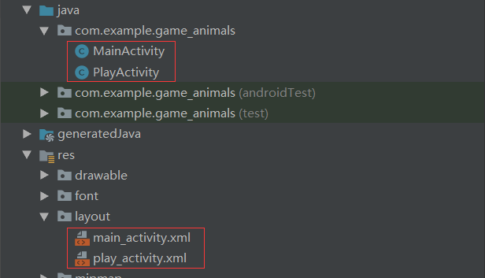

# Game_Animals

## Demonstration



Two activities



The gameplay is very easy. You should find all the different images in a limited time. One of the four pictures is different type. If you press the different one, the first progress will increase to the second progress. But if you press the same one, the second progress will reduce to the first progress. 

Refresh the images function

```
private void RefreshImages();
```

